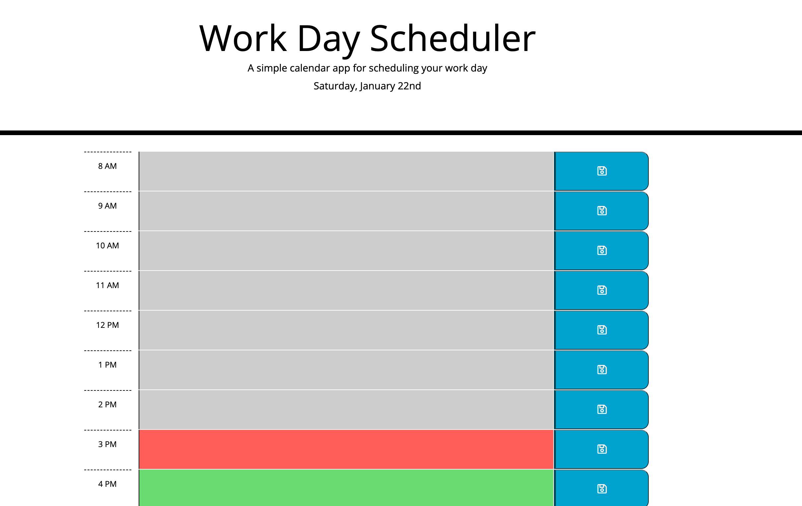

# work-day-scheduler

## Purpose
A time blocking application that shows someone a visual representation of how many hours are left before clocking out and allows them to create separate tasks to tackle each hour.

## Built With
* HTML
* CSS
* JavaScript

## Deployed Application
https://drewspeed.github.io/work-day-scheduler/

## Screenshot

### Made by Drew Speed
